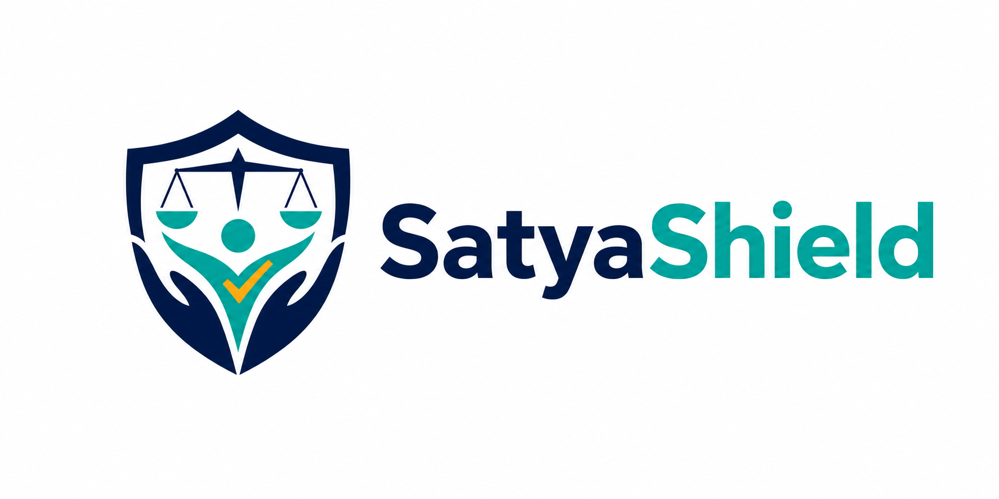

# SatyaShield

<p align="center">
  
</p>

SatyaShield is a privacy-focused MERN application for reporting dowry-harassment concerns, privately tracking a case, and coordinating authorized NGO, investigator, and administrative work.

> SatyaShield is not an emergency-dispatch service. It does not guarantee police, ambulance, NGO, message-delivery, or response outcomes.

## Highlights

- Anonymous complaint intake with structured safety questions and explicit privacy acknowledgment.
- One-time reporter access secret; only its keyed hash is retained.
- Complaint-scoped tracking, evidence, chat, and internal SOS access.
- Encrypted private evidence vault with lifecycle and integrity controls.
- Staff authentication with rotating sessions, CSRF protection, TOTP MFA, and recovery codes.
- Exact-resource authorization for NGOs, investigators, administrators, and superadministrators.
- Deterministic NGO matching, capacity checks, assignment acknowledgment, and immediate revocation.
- Deterministic triage, immutable assessment history, and restricted human overrides.
- Internal deadlines, idempotent escalation scheduling, and complaint-scoped Socket.IO chat.
- English and Hindi interface catalogs with automated parity and visible-string checks.
- Provider-neutral notification queue and review-gated legal-information architecture.

External AI and external SOS delivery are disabled.

## Architecture

The React client calls a versioned Express API. MongoDB stores case and workflow records; private evidence is encrypted before it reaches isolated storage. Reporter and staff credentials use separate token purposes and authorization boundaries. Realtime chat revalidates complaint access and supports immediate revocation.

See [Architecture and security](docs/architecture-and-security.md), [Authorization matrix](docs/authorization-matrix.md), and [Privacy data flow](docs/privacy-data-flow.md).

## Screenshots

### Home


### Anonymous complaint intake


### Authorized staff login


## Technology

- React 18, Vite, Tailwind CSS, and React Router
- Node.js and Express
- MongoDB Atlas with Mongoose
- Socket.IO
- JWT, rotating refresh tokens, TOTP, AES-GCM, HMAC, and scrypt
- Node test runner, Playwright, and axe-core

## Local setup

Requirements: Node.js 20.12 or newer, npm, and a dedicated development MongoDB database.

```bash
git clone https://github.com/bharshit63880/SatyaShield.git
cd SatyaShield
npm install
```

Copy the example environment files and provision unique development secrets:

```powershell
Copy-Item server/.env.example server/.env
Copy-Item client/.env.example client/.env
```

Never commit `.env` files or reuse development secrets in production.

```bash
npm run dev
```

- Frontend: `http://localhost:5173`
- Backend: `http://localhost:5000`

## Validation

```bash
npm run test:i18n --workspace client
npm test --workspace client
npm run build
npm test --workspace server
npm run test:e2e --workspace client
npm run test:mongodb --workspace server
```

MongoDB runtime tests require an explicitly guarded test database. Automated browser tests use fake adapters and must never contact real recipients or emergency services.

See [Testing guide](docs/testing.md) and [Deployment guide](docs/deployment.md).

## Honest limitations

- No real email or notification provider is configured or verified.
- No production helplines are published; entries require authoritative review.
- SOS performs internal routing only and does not dispatch external help.
- Chat is not end-to-end encrypted.
- A production malware scanner is not configured, so production evidence availability must remain fail-closed.
- Socket.IO is explicitly single-instance until a shared adapter is configured.
- Manual screen-reader review, qualified legal/privacy review, deployed TLS-cookie verification, monitoring, and isolated backup restoration remain external readiness gates.
- No response, complete anonymity, guaranteed deletion, legal certification, or production readiness is claimed.

## Documentation

- [Architecture and security](docs/architecture-and-security.md)
- [Authorization matrix](docs/authorization-matrix.md)
- [Privacy data flow](docs/privacy-data-flow.md)
- [Notifications and reviewed content](docs/notifications-and-content.md)
- [Testing guide](docs/testing.md)
- [Deployment guide](docs/deployment.md)
- [Operations, backup, and incident response](docs/operations.md)
- [Accessibility and translation status](docs/accessibility.md)
- [Known limitations](docs/known-limitations.md)
- [Changelog](CHANGELOG.md)
