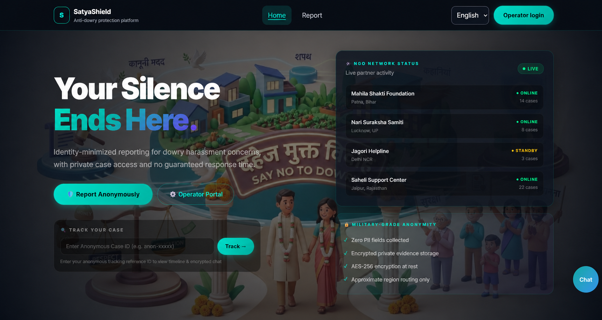
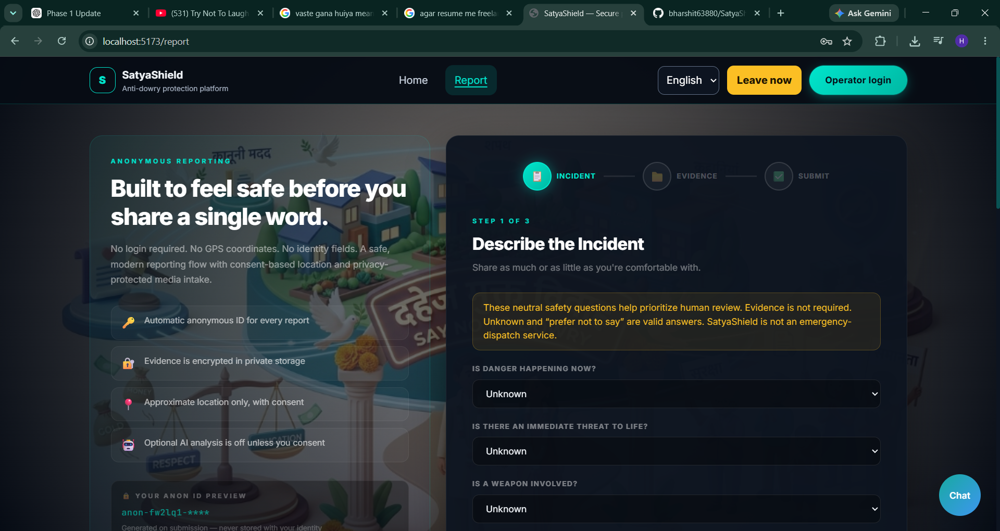
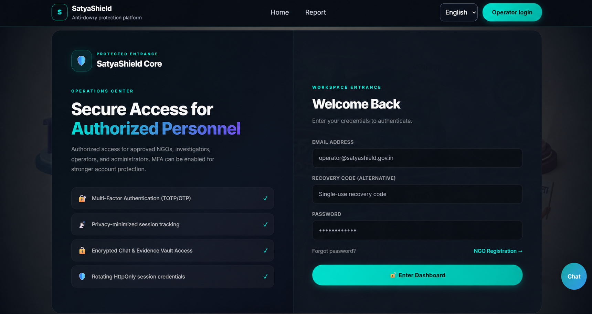

# SatyaShield — Secure Anti-Dowry Reporting & Case Coordination Platform

<p align="center">
  A privacy-focused MERN platform for identity-minimized dowry-harassment reporting, protected case tracking, and controlled collaboration between authorized NGOs, investigators, and administrators.
</p>

<p align="center">
  <a href="https://satya-shield-client.vercel.app"><strong>Open Live Demo</strong></a>
  &nbsp;•&nbsp;
  <a href="https://satyashield-api.onrender.com/api/v1/health">API Health</a>
  &nbsp;•&nbsp;
  <a href="docs/architecture-and-security.md">Architecture &amp; Security</a>
</p>

> [!IMPORTANT]
> **PUBLIC DEMO AND INTERNAL EVALUATION ONLY — NOT A LIVE CASEWORK OR EMERGENCY SERVICE**
>
> SatyaShield is engineered as a substantial full-stack system whose architecture can support real complaint workflows, verified NGO participation, evidence handling, staff review, realtime communication, escalation, and internal SOS coordination when it is operated with approved organizations, qualified personnel, production infrastructure, monitoring, legal review, and audited security controls.
>
> **The current public deployment is intentionally restricted to demonstration and internal evaluation. It must not be used for actual complaints, real NGO casework, emergency assistance, or time-sensitive safety situations.** External emergency delivery is disabled, no response is guaranteed, and the platform does not contact police, ambulances, emergency responders, or public helplines. These restrictions are deliberate safeguards—not missing marketing claims.

## Overview

SatyaShield demonstrates how a sensitive social-impact workflow can be built around data minimization, exact-resource authorization, encrypted evidence, deterministic decision rules, and human oversight. Reporters receive one-time case credentials instead of creating an identity-linked account, while each staff role receives only the access required for its assigned responsibilities.

The application includes a React interface, an Express API, MongoDB-backed workflows, complaint-scoped Socket.IO communication, private evidence controls, role-based workspaces, and bilingual English/Hindi interface catalogs.

## Core capabilities

- **Identity-minimized reporting** — complaint intake avoids requesting a reporter's name, phone number, exact address, or exact GPS coordinates.
- **One-time private case access** — reporters receive a case ID and one-time access secret; only a keyed hash of the secret is retained.
- **Structured safety triage** — deterministic answers guide review priority without narrative keyword scanning or external AI scoring.
- **Human review controls** — immutable assessment history, review queues, restricted overrides, and explicit handling for Critical cases.
- **Private evidence vault** — authorized evidence workflows include encryption, integrity checks, metadata minimization, and access logging.
- **Exact-resource authorization** — reporter, NGO, investigator, administrator, and superadministrator permissions are separated and enforced per case.
- **NGO routing and assignments** — verification state, coverage, capability, capacity, acknowledgment, reassignment, and immediate revocation are modeled explicitly.
- **Secure staff authentication** — rotating refresh sessions, HttpOnly cookies, CSRF protection, TOTP MFA, recovery codes, and session revocation.
- **Realtime case communication** — persistent complaint-scoped chat supports reconnection recovery and live access revocation.
- **Escalation automation** — deadlines, scheduler leasing, retries, and idempotent internal workflow actions.
- **Internal SOS workflow** — confirmation, cancellation, duplicate prevention, and optional encrypted location sharing without external dispatch.
- **Bilingual and accessible interface** — English/Hindi catalogs, translation parity checks, keyboard support, responsive layouts, and automated accessibility coverage.
- **Privacy-safe auditability** — security-relevant events are recorded without intentionally placing reporter credentials or private case content in routine logs.

## Live application

| Component | Public endpoint | Purpose |
| --- | --- | --- |
| Web application | [satya-shield-client.vercel.app](https://satya-shield-client.vercel.app) | Public demonstration interface |
| API service | [satyashield-api.onrender.com](https://satyashield-api.onrender.com) | Render-hosted backend |
| Health endpoint | [API health check](https://satyashield-api.onrender.com/api/v1/health) | Service availability check |

The API uses Render's free service tier, so the first request after an idle period may take approximately 30–60 seconds. The demo uses safe, restricted integrations and does not activate real-world recipients or emergency delivery.

## Live deployment screenshots

The images below were captured directly from the public deployment.

<table>
  <tr>
    <td width="50%" align="center">
      <a href="docs/screenshots/home.png"></a><br />
      <sub><strong>Public home and private case entry</strong></sub>
    </td>
    <td width="50%" align="center">
      <a href="docs/screenshots/anonymous-report.png"></a><br />
      <sub><strong>Identity-minimized complaint intake</strong></sub>
    </td>
  </tr>
  <tr>
    <td colspan="2" align="center">
      <a href="docs/screenshots/operator-login.png"></a><br />
      <sub><strong>Protected staff workspace entrance</strong></sub>
    </td>
  </tr>
</table>

## Security and privacy design

- Reporter and staff credentials use separate token purposes and authorization boundaries.
- Refresh-token rotation and token-family reuse detection protect authenticated sessions.
- Complaint access is revalidated for HTTP requests and realtime socket activity.
- Assignment withdrawal or reassignment removes access immediately.
- Evidence is encrypted before private storage and is never intentionally exposed as a public static upload.
- External AI remains disabled and fails closed.
- SOS actions remain inside SatyaShield; external delivery invocation is disabled.
- Sensitive production values are supplied through environment configuration and are not committed to the repository.

Detailed design references are available in the [architecture and security overview](docs/architecture-and-security.md), [authorization matrix](docs/authorization-matrix.md), and [privacy data flow](docs/privacy-data-flow.md).

## Technology

- React 18, Vite, Tailwind CSS, and React Router
- Node.js and Express
- MongoDB Atlas and Mongoose
- Socket.IO
- JWT, rotating refresh tokens, TOTP, AES-GCM, HMAC, and scrypt
- Node test runner, Playwright, and axe-core
- Vercel frontend hosting and Render API hosting

## Local development

Requirements: Node.js 20.12 or newer, npm, and a dedicated development MongoDB database.

```bash
git clone https://github.com/bharshit63880/SatyaShield.git
cd SatyaShield
npm install
```

Copy the example environment files and provision unique development secrets:

```powershell
Copy-Item server/.env.example server/.env
Copy-Item client/.env.example client/.env
```

Never commit environment files, deployment credentials, reporter credentials, or reusable secrets.

```bash
npm run dev
```

- Frontend: `http://localhost:5173`
- Backend: `http://localhost:5000`

## Validation

```bash
npm run test:i18n --workspace client
npm test --workspace client
npm run build
npm test --workspace server
npm run test:e2e --workspace client
npm run test:mongodb --workspace server
```

MongoDB runtime tests require an explicitly guarded test database. Automated browser suites use deterministic fixtures and fake adapters; they must never contact real recipients, providers, NGOs, emergency services, or helplines.

See the [testing guide](docs/testing.md) and [deployment guide](docs/deployment.md) for the complete process.

## Deployment requirements for real operational use

The repository is a strong engineering foundation, but a real-world deployment would require all of the following before accepting actual cases:

- Legally approved operating policies, consent language, retention rules, and jurisdiction-specific review.
- Contracted and independently verified NGOs, investigators, administrators, and escalation owners.
- A monitored multi-instance realtime architecture with a shared Socket.IO adapter.
- A production malware scanner and durable, private, encrypted evidence storage.
- Verified email/notification providers and tested delivery-failure procedures.
- Production TLS-cookie verification, secrets management, audit monitoring, backups, restoration drills, and incident response.
- Human accessibility and screen-reader review, professional language review, and security assessment.
- Clear service-level expectations and staffed operational processes.
- A separately designed and authorized external emergency-response integration, if one is ever required.

Until those controls exist and are independently approved, SatyaShield must remain a demonstration/internal-evaluation system.

## Current limitations

- No real email or external notification provider is configured or verified.
- No production helplines are published.
- SOS performs internal routing only and does not dispatch external help.
- Chat is not end-to-end encrypted.
- Evidence availability remains fail-closed because a production malware scanner and durable private storage are not configured for the public demo.
- Socket.IO is configured for a single application instance until a shared adapter is introduced.
- Manual screen-reader review, qualified legal/privacy review, deployed TLS-cookie verification, monitoring, and isolated backup restoration remain external readiness gates.
- The system does not promise response, message delivery, NGO action, complete anonymity, guaranteed deletion, legal certification, or emergency assistance.

## Documentation

- [Architecture and security](docs/architecture-and-security.md)
- [Authorization matrix](docs/authorization-matrix.md)
- [Privacy data flow](docs/privacy-data-flow.md)
- [Notifications and reviewed content](docs/notifications-and-content.md)
- [Testing guide](docs/testing.md)
- [Deployment guide](docs/deployment.md)
- [Operations, backup, and incident response](docs/operations.md)
- [Accessibility and translation status](docs/accessibility.md)
- [Known limitations](docs/known-limitations.md)
- [Changelog](CHANGELOG.md)

## Contributing and license

Contributions are welcome when they preserve SatyaShield's security, privacy, accessibility, and safety boundaries. Read [CONTRIBUTING.md](CONTRIBUTING.md) before participating.

SatyaShield is available under the [MIT License](LICENSE). The license permits use, modification, and distribution of the software, but it does not provide operational approval, legal certification, emergency-service authorization, or any warranty.

## Responsible use

SatyaShield is an engineering project and demonstration platform. It is not legal advice, a law-enforcement system, an emergency-dispatch service, or a guarantee of safety or organizational response. In an immediate emergency, contact the appropriate locally verified emergency service through a trusted device or person.
